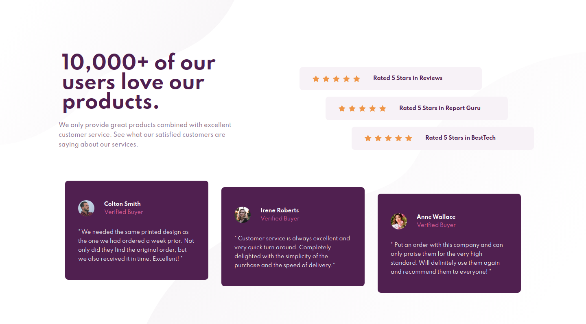
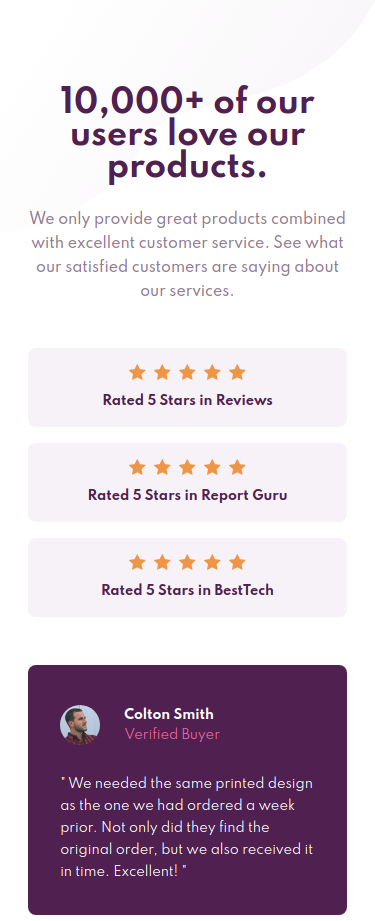

# Frontend Mentor - Social proof section solution

This is a solution to the [Social proof section challenge on Frontend Mentor](https://www.frontendmentor.io/challenges/social-proof-section-6e0qTv_bA). Frontend Mentor challenges help you improve your coding skills by building realistic projects. 

## Overview

### The challenge

Users should be able to:

- View the optimal layout for the section depending on their device's screen size

### Screenshots

## My process

### Built with

- Semantic HTML5 markup
- CSS custom properties
- Flexbox
- CSS Grid
- Mobile-first workflow

### What I learned

I recently read about the BEM naming convention and wanted to try applying it for the first time. This would also be the first time I use a CSS reset, which basically renders elements in a more consistent way across browsers. Aside from that, I continued to practice using CSS Grid and Flexbox as well as using media queries to make the page responsive.

### Continued development

I started this project and returned to it unsure of where I left off, so going forward, I'll create a to-do list to refer to when continuing a project.

### Useful resources

- [CSS with BEM](https://en.bem.info/methodology/css/) - This site is bettering my understanding of the BEM naming convention. Didn't find it until after starting this project, however.
- [A modern CSS reset](https://piccalil.li/blog/a-modern-css-reset/) - Here is the CSS reset that I used; this article breaks it down in detail.